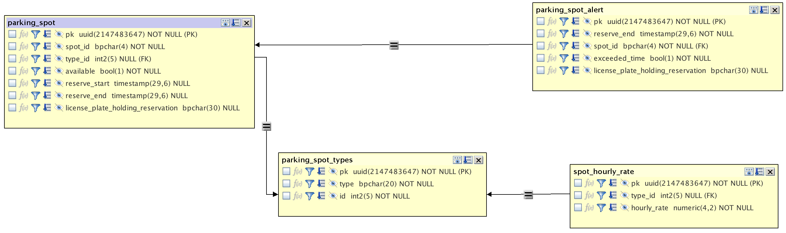

## QUICK-PARK is a bit of SQL executed using python
## this is a simple aplication designed to showcase Transactional behavior while using an RDBMS

## The premise is a car parking app where there is competition for parking spots for various cars & trucks 

To run the example:

1. initialize the python virtual environment specific to this project:
``` 
python3 -m venv qp_env
``` 
2. activate the python environment:  [This step is repeated anytime you want this qp environment back]
``` 
source qp_env/bin/activate
``` 
3. Install the libraries: [only necesary to do this one time per environment]
```
pip3 install -r requirements.txt
```
4. Connect to your postgres-compatible database and execute the DDL necessary to construct the tables used by this little application:


### FYI: Initial Data for this mini-app can be loaded using the sql commandline client provided with cockroachdb in the following manner: (assumes you started cockroachdb in insecure mode and are in the same directory as this readme and the datasetup.sql file)
```
$ cockroach sql --insecure --user=root --host=localhost --database=defaultdb -f datasetup.sql
```
### how to start a local single instance of cockroachdb suitable for lightweight testing/dev work:  (add a space and an ampersand at the end of the command if you want it to run in the background)
```
cockroach start-single-node \
  --insecure \
  --listen-addr=localhost:26257 \
  --http-addr=localhost:8080
```

### It may be helpful to read through the contents of the datasetup.sql file
### To understand the DDL / data model, and sample SQL for this mini-app

### In addition to the commands in the datasetup.sql file... The following statements can be executed from any SQL client for example you may use psql: (replace your user, port and host values to match your environment)

``` 
psql -U root -p 26000 -h 192.168.1.20

-- look at what tables exist in your database:
SHOW tables;

-- check the state of the parking lot:
SELECT 
  ROW_NUMBER() OVER(),
  COUNT(pst.type) OVER(PARTITION BY pst.type) AS SPOTS_OF_TYPE,
  ps.spot_id,pst.type,available
FROM parking_spot ps
JOIN parking_spot_types pst
ON ps.type_id = pst.id;

-- check to see if an alert needs to be added (in a future version, alerts could be used to facilitate notifying management and clients, and tow trucks)
-- alerts come in two flavors: 
-- if a row exists and exceeded_time is false: the reservation is close to expiring (10 min warning)
-- if a row exists and exceeded time is true: the reservation has been exceeded, and some action may be necessary (calling a tow truck?) 

-- sample alert INSERT:
INSERT INTO quick_park.parking_spot_alert (reserve_end, spot_id, license_plate_holding_reservation, exceeded_time) 
SELECT reserve_end, spot_id, license_plate_holding_reservation, 
CASE WHEN reserve_end BETWEEN  now() - INTERVAL '10 minutes' AND now() THEN false 
  WHEN reserve_end < now() THEN true 
  ELSE false 
  END
FROM quick_park.parking_spot 
WHERE reserve_end IS NOT NULL 
AND spot_id NOT IN (SELECT spot_id from quick_park.parking_spot_alert); 

-- this next statement updates an alert after it is originally inserted: 

UPDATE quick_park.parking_spot_alert SET exceeded_time = true WHERE reserve_end > now(); 

-- what do we see in the alerts table?

select * from quick_park.parking_spot_alert;
```

## OK - now to run this little application:

5. Provide the url to your database as an env variable: (adjust your username, hostname, port, database name as is appropriate)
```
export DATABASE_URL='postgresql://root@localhost:26257/quick_park?sslmode=insecure'
```
6. Execute the simple_park.py code from the project directory.
```
(qp_env) devload@devload quick_park % python3 simple_park.py -v -min 3 -max 5 -ltms 3000
```

|                                   argument                                     |                    explanation                          |
| ------------------------------------------------------------------------------ | ------------------------------------------------------- |
| -v                                              | turns on verbose logging (debug level)         |
| -min <some-number>                                          | set minimum # of connections in db pool (defaults to 2) |
| -max <some-number>                                | set maximum # of connections in db pool (defaults to 20)|
| -ltms <some-number> (defaults to 1000)             | latency threshold in milliseconds: below which, no performance-related logging occurs |


### When the app starts it offers 4 options for the user:
* mr (make a single parking spot reservation)
* qs (query the parking spots for latest state)
* loop (setup and run multiple threads that randomly fill and empty parking spots)
* end (quit the program - cleaning up the connections used)

### If you choose to run multiple threads in the loop option offered, you are likely to encounter an occasional exception caused by either: 
1. a duplicate license plate number used when reserving a parking spot (caused by the application using some randomness in its generation of license plate numbers)
2. a failure of a TX (transaction) due to attempts by multiple threads to update the same row 

## sample execution:
```
(qp_env) owentaylor@Owens-MacBook-Pro quick-park % python3 simple_park.py -ltms 600 -min 10 -max 30
INFO:root:ARGS set to: verbose == False

**********************************************
        Type: END   and hit enter to exit the program...

        Commandline Instructions: 
TYPE your preferred action from this list:
(only hit enter for the purpose of submitting your selection)

**********************************************

Your Options:
Make single reservation (mr)
query parking space state (qs)
loop with threads (loop)
end program (END) :     qs

  row   SPOTS_OF_TYPE  spot_id    type           available
------------------------------------------------------------
  1               4  3B          electric              True
  2               4  3C          electric              True
  3               4  1E          electric              True
  4               4  3A          electric              True
  5               4  2B          regular_car           False
  6               4  1A          regular_car           True
  7               4  2A          regular_car           True
  8               4  1B          regular_car           True
  9               2  1C          small_car             False
 10               2  1D          small_car             False
 11               2  2D          truck                 True
 12               2  2C          truck                 True

        hit enter to continue...


**********************************************
        Type: END   and hit enter to exit the program...

        Commandline Instructions: 
TYPE your preferred action from this list:
(only hit enter for the purpose of submitting your selection)

**********************************************

Your Options:
Make single reservation (mr)
query parking space state (qs)
loop with threads (loop)
end program (END) :     loop

How many times should each thread loop? (25): 25
How many threads to start? (2): 2
INFO:root:1746118968958 Starting 2 threads with 25 iterations each...

T H R E A D #0 --> STARTING LOOP 
T H R E A D #1 --> STARTING LOOP 
INFO:root:1746118969972 2 threads finished

        hit enter to continue...


**********************************************
        Type: END   and hit enter to exit the program...

        Commandline Instructions: 
TYPE your preferred action from this list:
(only hit enter for the purpose of submitting your selection)

**********************************************

Your Options:
Make single reservation (mr)
query parking space state (qs)
loop with threads (loop)
end program (END) :     qs

  row   SPOTS_OF_TYPE  spot_id    type           available
------------------------------------------------------------
  1               4  3B          electric              True
  2               4  3C          electric              True
  3               4  1E          electric              True
  4               4  3A          electric              True
  5               4  2B          regular_car           False
  6               4  1A          regular_car           False
  7               4  2A          regular_car           False
  8               4  1B          regular_car           False
  9               2  1C          small_car             True
 10               2  1D          small_car             False
 11               2  2D          truck                 True
 12               2  2C          truck                 True
```
